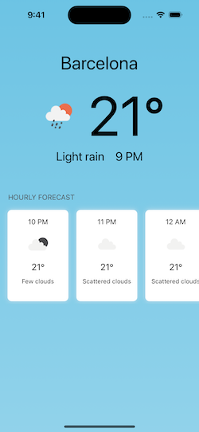
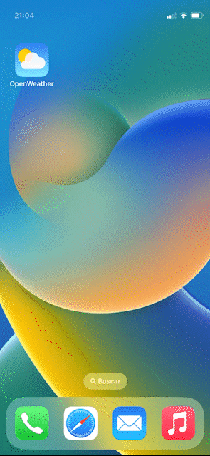
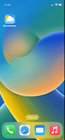
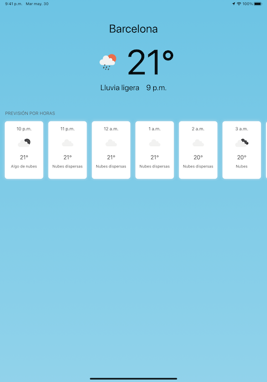
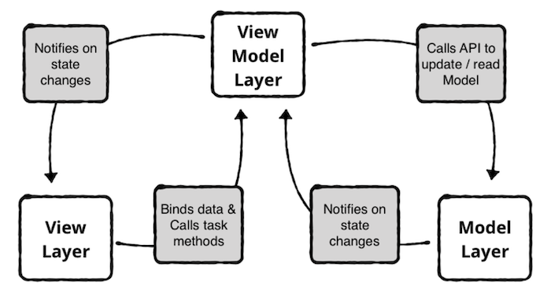
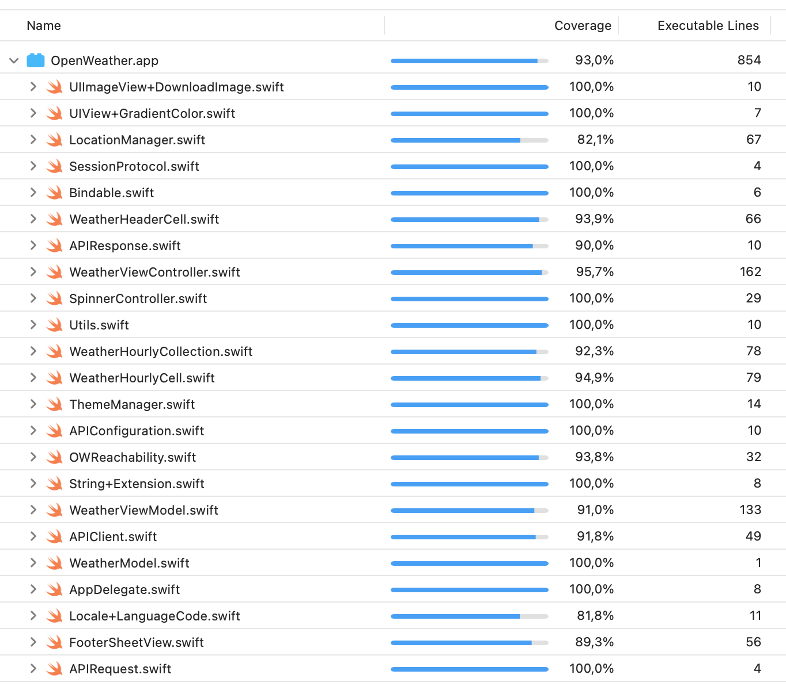

# OpenWeather app example

Open weather view consists on a list of data hourly weather in your localization. The header of the view has a big view with the city name, the temperature, the current time, the icon and the description. Below the header, the view has an horizontal collection with weather next hours with the same info but in minor size.
  

- This demo app support iPhone and iPad layouts and implements a open weather view. 
- This app is compatible with iOS 11 or higher. 
- The app uses swift package manager for dependency management. 
- All the user interface has been done using swift code. No Storyboards or xibs have been used. 
- The app has nit test and ui test with a coverage of 93%.
  

Open weather app meets the following requirements: 
- Supports Spanish and English languages. Gets the language that the user has selected in iOS. 
- Location support: Gets the coordinates and city name of the user's device. 
- Manage location permissions, following Apple's guidelines, using the own iOS libraries. 
- The app obtains the data from the Open Weather weather service. Getting the hourly forecast for today.  
- The app handle internet connection error control too. 
- Once the main screen is loaded, it allows you to reload the data by scrolling. 
  
• [WeatherViewController](https://github.com/carlosmobile/OpenWeather/blob/main/OpenWeather/WeatherScene/WeatherViewController.swift): Weather main view. 
• [WeatherViewModel](https://github.com/carlosmobile/OpenWeather/blob/main/OpenWeather/ViewModel/WeatherViewModel.swift): Weather viewModel. 

 
  
Example gifs with iPhone 14 Xcode simulator:

     

     

  
Example image with iPad Pro (11 inch) Xcode simulator:
 
  
 
   

# Architecture

I use native <b>SwiftUI MVVM</b>, of course this is a flexible architecture and I can implement it in a basic or advanced way as needed.
This project works with UIKit.   
MVVM is a "reactive" architecture. Its a perfect fit to use Bindings. The view reacts to changes on the view model, and the view model updates its state based on data from the model.

  

MVVM involves three layers:

- The <b>model layer</b> contains data access objects and validation logic. It knows how to read and write data, and it notifies the view model when data changes.  
- The <b>view model layer</b> contains the state of the view and has methods to handle user interaction. It calls methods on the model layer to read and write data, and it notifies the view when the model’s data changes.  
- The <b>view layer</b> styles and displays on-screen elements. It doesn’t contain business or validation logic. Instead, it binds its visual elements to properties on the view model. It also receives user inputs and interaction, and it calls methods on the view model in response.  
As a result, the view layer and model layer are completely decoupled. The view layer and model layer only communicate with the view model layer but we can binding model to view with Combine if we need to use reactive programming way.

This architecture has been used because it's considered an advance architecture that modulates the code and respect the clean code, SOLID principles and the best practices.

   

# Tools

- [Bindable](https://github.com/carlosmobile/OpenWeather/blob/main/OpenWeather/Helpers/Bindable.swift): Helper to use reactive programming without external library. 
- [LocationManager](https://github.com/carlosmobile/OpenWeather/blob/main/OpenWeather/Helpers/LocationManager.swift): To manage user location. 
- [OWReachability](https://github.com/carlosmobile/OpenWeather/blob/main/OpenWeather/Helpers/OWReachability.swift): To handle internet error. 
- [SpinnerController](https://github.com/carlosmobile/OpenWeather/blob/main/OpenWeather/Helpers/SpinnerController.swift): To show a way to know if views are loading weather data. 
- [Utils](https://github.com/carlosmobile/OpenWeather/blob/main/OpenWeather/Helpers/Utils.swift): Some global functions to get weather url icon or to get hourly time with format 
  

# Common

- [WeatherHeaderCell](https://github.com/carlosmobile/OpenWeather/blob/main/OpenWeather/Reusable%20Components/WeatherHeaderCell.swift): To show big header current weather. 
- [WeatherHourlyCollection](https://github.com/carlosmobile/OpenWeather/blob/main/OpenWeather/Reusable%20Components/WeatherHourlyCollection.swift): To load a collection with hourly weather. 
- [WeatherHourlyCell](https://github.com/carlosmobile/OpenWeather/blob/main/OpenWeather/Reusable%20Components/WeatherHourlyCell.swift): Cell with data of each collection hourly weather. 
- [FooterSheetView](https://github.com/carlosmobile/OpenWeather/blob/main/OpenWeather/Reusable%20Components/FooterSheetView.swift): To show location alert and internet error alert 
  

# Extension class

- [String+Extension](https://github.com/carlosmobile/OpenWeather/blob/main/OpenWeather/Helpers/String%2BExtension.swift): Useful string extension to manage multilanguage or capitalized first letter of string. 
- [UIView+GradientColor](https://github.com/carlosmobile/OpenWeather/blob/main/OpenWeather/Helpers/UIView%2BGradientColor.swift): To generate an amazing gradient color to main background. 
- [UIImageView+DownloadImage](https://github.com/carlosmobile/OpenWeather/blob/main/OpenWeather/Helpers/UIImageView%2BDownloadImage.swift): To manage third party library to download images. 
- [Locale+LanguageCode](https://github.com/carlosmobile/OpenWeather/blob/main/OpenWeather/Helpers/Locale%2BLanguageCode.swift): To get current local language code. 
  

# Model

Structs:

- [WeatherModel](https://github.com/carlosmobile/OpenWeather/blob/main/OpenWeather/Model/WeatherModel.swift): To model Weather data. 
  

# Networking

- [APIConfiguration](https://github.com/carlosmobile/OpenWeather/blob/main/OpenWeather/Networking/APIConfiguration.swift): Struct and enum to centralized network url and others. 
- [APIRequest](https://github.com/carlosmobile/OpenWeather/blob/main/OpenWeather/Networking/APIRequest.swift): Class to implement request configuration. 
- [APIResponse](https://github.com/carlosmobile/OpenWeather/blob/main/OpenWeather/Networking/APIResponse.swift): Extension to decode API response. 
- [APIError](https://github.com/carlosmobile/OpenWeather/blob/main/OpenWeather/Networking/APIError.swift): Enum to handle error type. 
- [APIClient](https://github.com/carlosmobile/OpenWeather/blob/main/OpenWeather/Networking/APIClient.swift): Class to implement URLSession. 
- [SessionProtocol](https://github.com/carlosmobile/OpenWeather/blob/main/OpenWeather/Networking/SessionProtocol.swift): URLSession dataTask. 

  
# Tests

This app test ViewModels, Models, Helpers, Common components, mock data, etc.. with 
  
<b>XCTests/UITests</b>  
- [TestAPIClient](https://github.com/carlosmobile/OpenWeather/blob/main/OpenWeatherTests/TestAPIClient.swift): Test Network layer. 
- [TestHelpers](https://github.com/carlosmobile/OpenWeather/blob/main/OpenWeatherTests/TestHelpers.swift): Test Tools and extensions . 
- [TestModel](https://github.com/carlosmobile/OpenWeather/blob/main/OpenWeatherTests/TestModels.swift): Test WeatherModel. 
- [TestViewModels](https://github.com/carlosmobile/OpenWeather/blob/main/OpenWeatherTests/TestViewModels.swift): Test WeatherViewModel. 
- [OpenWeatherUITests](https://github.com/carlosmobile/OpenWeather/blob/main/OpenWeatherUITests/OpenWeatherUITests.swift) 
 
Test Coverage 93%
  

  

  
# Swift Guide Style

The app code follows the [Ray Wenderlich Swift Style Guide](https://github.com/raywenderlich/swift-style-guide). 
  
# Centralized data

The app uses in "support" logical folder a [ThemeManager.swift](https://github.com/carlosmobile/OpenWeather/blob/main/OpenWeather/Support/ThemeManager.swift) class to support centralized colors. It also uses multilanguage with Localizable.strings to centralized all the text in the app.
  
# Swift Package Manager

- [Kingfisher](https://github.com/onevcat/Kingfisher): Used to implement an easy way to download images from server with animation spinner and fade. 
  
# GitFlow

This app is developed using [GifFlow](https://www.atlassian.com/git/tutorials/comparing-workflows/gitflow-workflow), using only git commands and tool sourcetree.
  
# Design

The app try to implement nice design and UI/UX, respecting the iOS native elements as Apple guidelines and have a correct layout and implement the safe areas to correct view in last iPhone models.

  

# Getting Started

Running in Xcode 14.3 and iOS 16.4 Written in Swift 5
  

# Next..

Add animated background, show more weather info, improve error control, etc..
  

